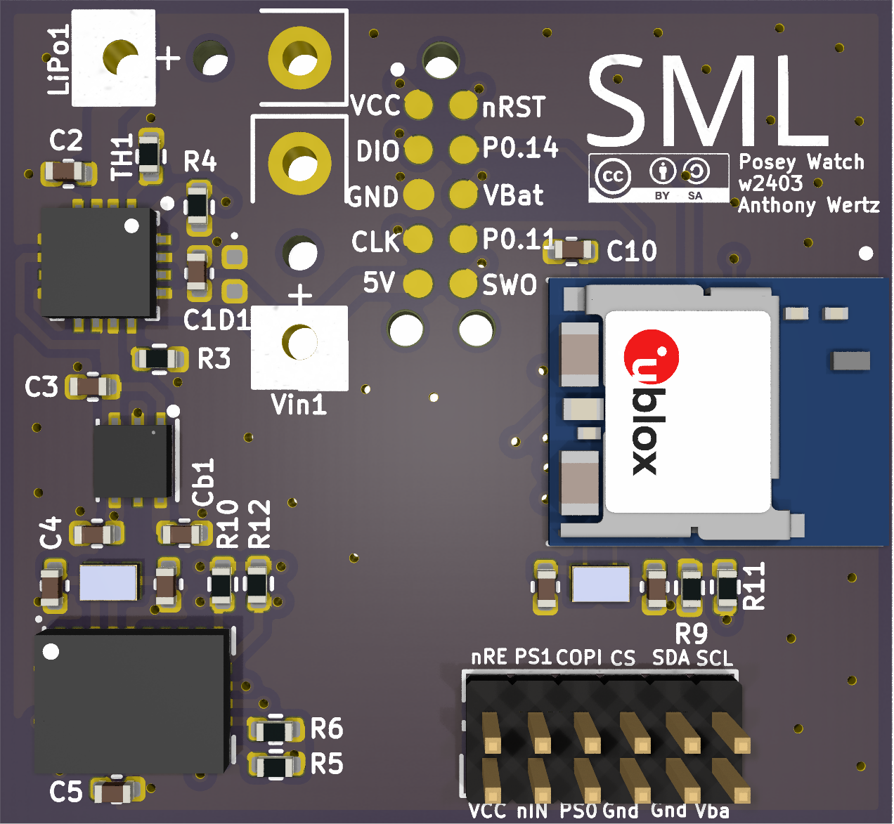

# Posey Watch Platform

This is a simple IMU hardware platform sized to fit in a watch.

It includes:

- nRF52840 ARM microtroller with BLE radio
- CEVA BNO086 9-axis IMU
- Lithium-polymer operation and charging

## Author

[Anthony Wertz](https://me.anthonywertz.com)

## License

Shield: [![CC BY-SA 4.0][cc-by-sa-shield]][cc-by-sa]

This work is licensed under a
[Creative Commons Attribution-ShareAlike 4.0 International License][cc-by-sa].

[![CC BY-SA 4.0][cc-by-sa-image]][cc-by-sa]

[cc-by-sa]: http://creativecommons.org/licenses/by-sa/4.0/
[cc-by-sa-image]: https://licensebuttons.net/l/by-sa/4.0/88x31.png
[cc-by-sa-shield]: https://img.shields.io/badge/License-CC%20BY--SA%204.0-lightgrey.svg
